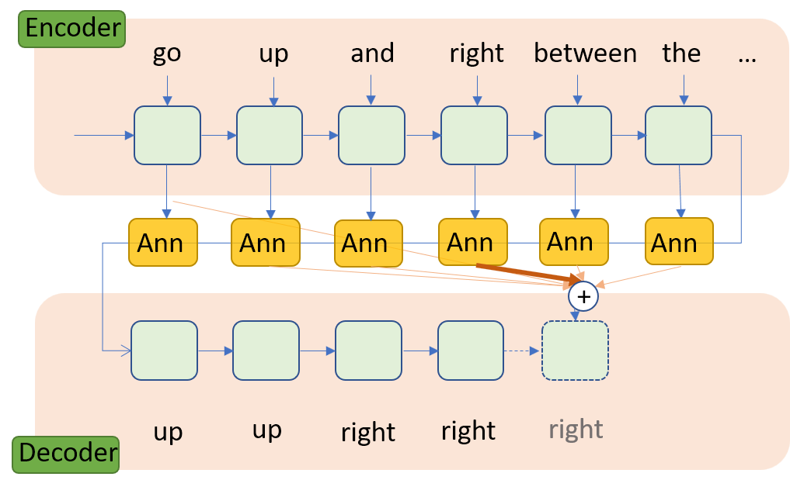

This repository is used to store code for sequence to sequence model 
used to turn textual instructions into execution to navigate a block to traverse
a maze created with structures of different shapes and colors.

## Data

300 videos of maze navigation are stored in target/0, target/1, target/2


Annotation data is stored at *Maze traversal annotation.xlsx*

Samples of instructions corresponding to that video:

```
move the purple square down on the right side of the blue L and red L then move the purple square left between red L and purple L and it ends at the left side of the purple L

move the purple block down then left so that's directly between the blue L shape and the red L shape then move it down again until it reaches the top of the red L shape then move it straight left until it reaches 1 cell beyond the purple L shape

move the purple block down until it is in position between the 2 red L shapes and move it to the left until it is in front of purple L shape then move it down 1 block space

move the purple block down on the right of the blue L left and between the 2 red Ls to the left of the purple L
```

## Needed library

```
pip install opencv-python

pip install tensorflow==1.8.0
```

## Models

Baseline model (Bahdanau attention model)



Improved model (Attention with feedback loop)

